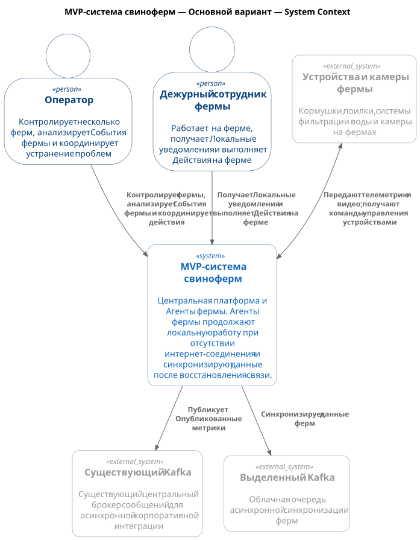
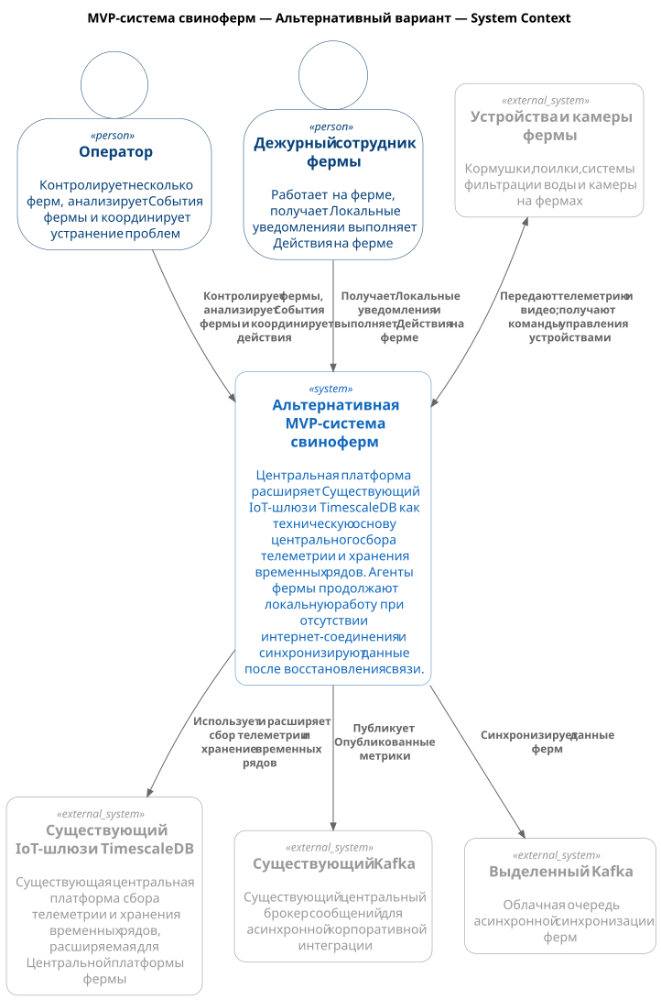

# ADR-001: Основа Центральной платформы для MVP

**Статус:** ⚠️ На рассмотрении  
**Участники:** Владелец продукта; архитектор решения  
**Дата:** 2026-09-01

**Универсальный язык:** [ubiquitous-language.ru.md](../ubiquitous-language.ru.md)

---

## 1. Контекст

MVP-система свиноферм должна собирать данные нескольких ферм. Оператор должен контролировать фермы и анализировать События фермы.

Каждый Агент фермы должен работать при недоступности интернет-соединения. Он должен сохранять данные локально и отправлять их после восстановления связи.

Требуется сравнить два варианта реализации Центральной платформы. Основной вариант создаёт Центральную платформу с новым Центральным сервисом синхронизации и новым Центральным хранилищем. В альтернативном варианте Центральная платформа использует и адаптирует Существующий IoT-шлюз и TimescaleDB. Существующий IoT-шлюз предоставляет Центральный сервис синхронизации, а TimescaleDB расширяется данными и схемой свиноводческих ферм. Обе системы остаются внешними для Центральной платформы.

## 2. Требования

### Функциональные

| Категория             | Требование                                                                                              |
| --------------------- | ------------------------------------------------------------------------------------------------------- |
| Мониторинг            | Оператор контролирует несколько ферм и анализирует События фермы.                                       |
| Локальные уведомления | Дежурный сотрудник фермы получает Локальные уведомления и реагирует на проблемы фермы.                  |
| Устройства            | Система получает телеметрию и видео от устройств и камер фермы. Система передаёт им команды управления. |
| Синхронизация         | Агент фермы сохраняет данные локально и синхронизирует их после восстановления связи.                   |
| Интеграция            | Центральная платформа публикует Опубликованные метрики в Существующий Kafka; Farm Synchronization использует Выделенный Kafka. |

### Нефункциональные

| Категория     | Требование                                                                                                                                                        | Критичность |
| ------------- | ----------------------------------------------------------------------------------------------------------------------------------------------------------------- | ----------- |
| Автономность  | Локальные уведомления и управление устройствами не зависят от интернет-соединения.                                                                                | Высокая     |
| Изоляция      | Изменения MVP не должны нарушать работу Существующего IoT-шлюза.                                                                                                  | Высокая     |
| Оповещение    | От обнаружения нештатной ситуации Видеоаналитикой до Локального уведомления проходит не более 5 секунд.                                                           | Высокая     |
| Синхронизация | Задержка синхронизации между Агентом фермы и Центральной платформой не превышает 10 минут при нормальном соединении. Ограничение не учитывает проблемы со связью. | Высокая     |

## 3. Основной вариант

### Описание

Основной вариант создаёт Центральную платформу. Её Центральный сервис синхронизации принимает, обрабатывает и сохраняет данные, синхронизированные Агентами фермы.

Агент фермы включает Локальный шлюз устройств и Интеграцию с камерами. Локальный шлюз устройств отправляет команды управления, а Агент фермы отправляет Локальные уведомления независимо от интернет-соединения.

Существующий Kafka остаётся асинхронным корпоративным каналом для Опубликованных метрик. Выделенный Kafka используется как облачная очередь асинхронной Farm Synchronization. Kafka не участвует в Локальных уведомлениях, управлении устройствами или работе Агента фермы при отсутствии интернет-соединения.

### Контекстная диаграмма

> [!TIP]
> Установите в Chrome расширение <a href="https://chromewebstore.google.com/detail/svg-navigator/pefngfjmidahdaahgehodmfodhhhofkl" target="_blank">SVG Navigator</a>, чтобы просматривать диаграмму с масштабированием и панорамированием в отдельной вкладке.

Диаграмма: MVP-система свиноферм — Основной вариант — System Context

[Исходный код основной C1-диаграммы](01-01-primary.c4.context.puml)

### Аргументация

| Критерий           | Обоснование                                                                                                                                                                    |
| ------------------ | ------------------------------------------------------------------------------------------------------------------------------------------------------------------------------ |
| Изоляция           | Центральная платформа отделяет модель, API и эксплуатацию MVP от Существующего IoT-шлюза.                                                                                      |
| Автономность фермы | Локальный буфер сохраняет телеметрию, События фермы и состояние синхронизации. Локальные уведомления и управление устройствами выполняются при отсутствии интернет-соединения. |
| Интеграция         | Существующий Kafka передаёт Опубликованные метрики корпоративным потребителям; Выделенный Kafka передаёт данные Farm Synchronization. Kafka не участвует в Локальных уведомлениях и управлении устройствами. |

#### Последствия

**✅ Положительные:**

- MVP не изменяет Существующий IoT-шлюз.
- Команда определяет Центральный сервис синхронизации, его интерфейс и транспорт, модель данных и правила хранения для фермерского домена.
- Отказ интернет-соединения не блокирует Локальные уведомления и управление устройствами.
- Центральная платформа изолирует домен MVP и поддерживает бесшовное развитие в SaaS-платформу.

**⚠️ Негативные:**

- MVP дублирует часть возможностей Существующего IoT-шлюза и TimescaleDB.

**↗️ Зависимости:**

- Существующий Kafka и контракты Опубликованных метрик.
- Локальная инфраструктура, устройства и камеры каждой фермы.

### Компромиссы

Основной вариант изолирует новый домен MVP от Существующего IoT-шлюза и позволяет самостоятельно определить Центральный сервис синхронизации, его интерфейс и транспорт, модель данных, правила хранения, правила доступа и операционный мониторинг. Он позволяет комфортно надстраивать будущую SaaS-платформу, но для этого приходится реализовать, развернуть, эксплуатировать, контролировать и защитить Центральный сервис синхронизации и Центральное хранилище.

## 4. Альтернатива

### Расширение Существующего IoT-шлюза и TimescaleDB

Альтернативный вариант использует и расширяет Существующий IoT-шлюз и TimescaleDB как внешние системы. Существующий IoT-шлюз предоставляет Центральный сервис синхронизации, а TimescaleDB расширяется данными и схемой свиноводческих ферм.

Агент фермы и Существующий Kafka работают так же, как в основном варианте.

### Контекстная диаграмма

> [!TIP]
> Установите в Chrome расширение <a href="https://chromewebstore.google.com/detail/svg-navigator/pefngfjmidahdaahgehodmfodhhhofkl" target="_blank">SVG Navigator</a>, чтобы просматривать диаграмму с масштабированием и панорамированием в отдельной вкладке.

Диаграмма: MVP-система свиноферм — Альтернативный вариант — System Context

[Исходный код альтернативной C1-диаграммы](01-02-alternative.c4.context.puml)

| Вариант                                          | Плюсы                                                                                                                                    | Минусы                                                                                                              | Причина отсутствия выбора на данном этапе                                                                     |
| ------------------------------------------------ | ---------------------------------------------------------------------------------------------------------------------------------------- | ------------------------------------------------------------------------------------------------------------------- | ------------------------------------------------------------------------------------------------------------- |
| Расширение Существующего IoT-шлюза и TimescaleDB | Использует Существующий IoT-шлюз для Центрального сервиса синхронизации и TimescaleDB, расширенную данными и схемой свиноводческих ферм. | Требует оценки пригодности и изменения Существующего IoT-шлюза и TimescaleDB, а также согласования изоляции данных. | Данные не подтверждают поддержку Центрального сервиса синхронизации, изоляции данных и нужных правил доступа. |

## 5. Риски

1. **Несовместимость Существующего IoT-шлюза или TimescaleDB с требованиями MVP**  
   _Меры:_ до выбора альтернативы проверить пригодность Существующего IoT-шлюза для предоставления Центрального сервиса синхронизации и TimescaleDB для расширения данными и схемой свиноводческих ферм. Проверить изоляцию данных, правила хранения, правила доступа и влияние изменений на текущих пользователей. Убедиться, что изменения не нарушают работу Существующего IoT-шлюза для текущих пользователей.

2. **Недоступность интернет-соединения на ферме**  
   _Меры:_ хранить данные в Агенте фермы и синхронизировать их после восстановления связи.

3. **Нарушение Локальных уведомлений или управления устройствами из-за корпоративных интеграций**  
   _Меры:_ не использовать Kafka для Локальных уведомлений, управления устройствами и передачи видео или аудио в реальном времени.
