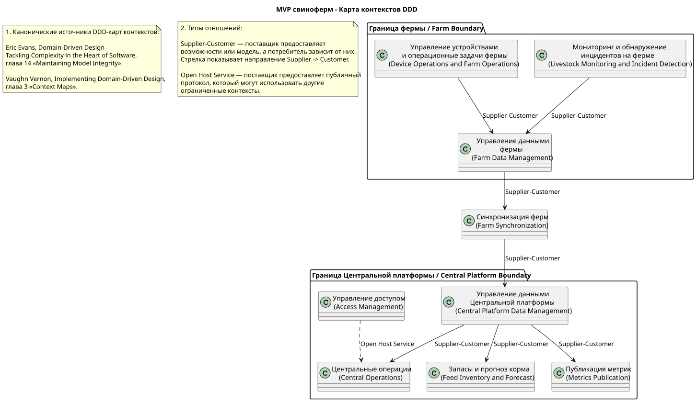

# ADR-002: Высокоуровневое видение контейнерных решений MVP

**Статус:** ⚠️ На рассмотрении  
**Участники:** Владелец продукта; архитектор решения  
**Дата:** 2026-09-01

**Универсальный язык:** [ubiquitous-language.ru.md](../ubiquitous-language.ru.md)

---

**Содержание**

- [1. Контекст](#1-контекст)
- [2. Требования](#2-требования)
  - [Функциональные](#функциональные)
  - [Нефункциональные](#нефункциональные)
- [3. Решение](#3-решение)
  - [Описание](#описание)
  - [Контейнерная диаграмма](#контейнерная-диаграмма)
  - [Ограниченные контексты и их ownership](#ограниченные-контексты-и-их-ownership)
  - [Аргументация](#аргументация)
    - [Последствия](#последствия)
- [4. Альтернативы](#4-альтернативы)
  - [Контейнерная диаграмма](#контейнерная-диаграмма-1)
- [5. Риски](#5-риски)

---

## 1. Контекст

MVP-система свиноферм должна работать с несколькими фермами. Оператор должен контролировать фермы и анализировать События фермы. Агент фермы должен продолжать локальную работу при отсутствии интернет-соединения, сохранять данные и синхронизировать их после восстановления связи.

Task 2 требует сравнить два варианта контейнерной архитектуры: выделенную Центральную платформу и расширение Существующего IoT-шлюза и TimescaleDB.

Архитектура использует две границы развёртывания. Граница фермы содержит Устройства и камеры фермы, Агент фермы, Локальное хранилище и Локальное S3 (MinIO). Граница Центральной платформы содержит Центральную платформу и Центральное S3 (MinIO). В альтернативном варианте Существующий IoT-шлюз и TimescaleDB остаются внешними системами.

---

## 2. Требования

### Функциональные

| Категория        | Требование                                                                                                                  |
| ---------------- | --------------------------------------------------------------------------------------------------------------------------- |
| Мониторинг       | Оператор контролирует несколько ферм и анализирует События фермы.                                                           |
| Локальная работа | Агент фермы получает телеметрию и видео, управляет устройствами, обнаруживает инциденты и отправляет Локальные уведомления. |
| Синхронизация    | Агент фермы сохраняет данные локально и синхронизирует их после восстановления связи.                                       |
| Интеграция       | Центральная платформа публикует Опубликованные метрики в Существующий Kafka.                                                |

### Нефункциональные

| Категория     | Требование                                                                                              | Критичность |
| ------------- | ------------------------------------------------------------------------------------------------------- | ----------- |
| Автономность  | Локальные уведомления и управление устройствами не зависят от интернет-соединения или Kafka.            | Высокая     |
| Изоляция      | Изменения MVP не должны нарушать работу Существующего IoT-шлюза.                                        | Высокая     |
| Оповещение    | От обнаружения нештатной ситуации Видеоаналитикой до Локального уведомления проходит не более 5 секунд. | Высокая     |
| Синхронизация | Задержка синхронизации не превышает 10 минут при нормальном соединении.                                 | Высокая     |

---

## 3. Решение

### Описание

Основным вариантом принимается выделенная Центральная платформа. Её Центральный сервис синхронизации принимает, обрабатывает и сохраняет Доменные факты от Агентов фермы в собственном Центральном хранилище. Центральное S3 (MinIO) хранит Артефакты данных.

Агент фермы работает автономно. Локальный буфер подготавливает Доменные факты к синхронизации, Локальное хранилище сохраняет их, а Локальное S3 (MinIO) сохраняет Артефакты данных. После восстановления связи Локальный сервис синхронизации публикует Доменные факты и Артефакты данных через выбранный надёжный транспорт в Центральный сервис синхронизации.

Существующий Kafka используется как асинхронный корпоративный канал для Опубликованных метрик. Для Farm Synchronization используется отдельный облачный Выделенный Kafka как надёжная асинхронная очередь. Он хранит горячую историю около 30 дней; Сервис архивирования сохраняет более старые сообщения в виде архивных объектов в Существующем S3-озере данных не реже одного раза в месяц. Выделенный Kafka не используется для Локальных уведомлений, управления устройствами, автономной работы или передачи видео и аудио в реальном времени.

### Контейнерная диаграмма

> [!TIP]
> Чтобы просматривать диаграмму с масштабированием и панорамированием в отдельной вкладке, установите в Chrome расширение <a href="https://chromewebstore.google.com/detail/svg-navigator/pefngfjmidahdaahgehodmfodhhhofkl" target="_blank">SVG Navigator</a>. Откройте диаграмму в новой вкладке и переключите страницу в формат `Raw`.

MVP-система свиноферм — Основной вариант — Container

Диаграмма: MVP-система свиноферм — Основной вариант — Container

MVP-система свиноферм — Основной вариант — Container

[Исходный код основной C2-диаграммы](02-01-primary.c4.container.puml)

### Ограниченные контексты и их ownership

Диаграмма ограниченных контекстов и их связей:

[Исходный код диаграммы ограниченных контекстов](ddd-context-map.ru.puml)

| Граница                          | Ограниченный контекст                       | Контейнер или сервис C2                                                            | Ответственность                                                                                      |
| -------------------------------- | ------------------------------------------- | ---------------------------------------------------------------------------------- | ---------------------------------------------------------------------------------------------------- |
| Ферма                            | Livestock Monitoring and Incident Detection | Агент фермы                                                                        | Видеоаналитика, обнаружение инцидентов и подсчёт поголовья.                                          |
| Ферма                            | Device Operations and Local Response        | Агент фермы                                                                        | Интеграция с устройствами, управление ими и Локальные уведомления.                                   |
| Ферма                            | Farm Data Management                        | Локальный буфер, Локальное хранилище, Локальное S3 (MinIO)                         | Локальное хранение Доменных фактов и подготовка данных к синхронизации.                              |
| Центральная платформа            | Central Operations                          | Центральная платформа, Центральное хранилище операций                              | Центральное представление, анализ и координация действий по нескольким фермам.                       |
| Центральная платформа            | Access Management                           | Центральная платформа                                                              | Аутентификация и авторизация по ролям.                                                               |
| Центральная платформа            | Metrics Publication                         | Центральная платформа                                                              | Формирование и публикация Опубликованных метрик.                                                     |
| Центральная платформа            | Feed Inventory and Forecast                 | Центральная платформа                                                              | Учёт запасов корма и межферменное прогнозирование.                                                   |
| Центральная платформа            | Central Platform Data Management            | Центральная платформа, Центральное хранилище данных, Центральное S3 (MinIO)        | Управление жизненным циклом синхронизированных Доменных фактов и их Артефактов данных.               |
| Сквозной поддерживающий контекст | Farm Synchronization                        | Локальный сервис синхронизации, Центральный сервис синхронизации, Выделенный Kafka | Приём и валидация входящих данных, а также их передача между Агентом фермы и Центральной платформой. |

На уровне C2 несколько ограниченных контекстов Центральной платформы намеренно развёрнуты внутри одного контейнера `Центральная платформа`. Это компромисс MVP: контексты сохраняют отдельное владение ответственностями и могут быть выделены в независимые микросервисы при росте нагрузки или изменении требований. `Farm Data Management` принадлежит Агенту фермы и поддерживает `Farm Synchronization`: он владеет жизненным циклом локальных данных, а `Farm Synchronization` только читает подготовленные данные и передаёт их. `Central Synchronization Service` принимает и валидирует входящие данные в составе `Farm Synchronization`; `Central Platform Data Management` владеет их сохранением и жизненным циклом через `Central Data Store` и `Central S3 (MinIO)`. `Farm Synchronization` остаётся отдельным поддерживающим контекстом, потому что его протокол и правила доставки пересекают границы фермы и Центральной платформы.

### Аргументация

| Критерий        | Обоснование                                                                                                                                                                                                         |
| --------------- | ------------------------------------------------------------------------------------------------------------------------------------------------------------------------------------------------------------------- |
| Изоляция        | Новый домен, API, модель данных, правила хранения и эксплуатация не изменяют Существующий IoT-шлюз.                                                                                                                 |
| Автономность    | Доменные факты и Артефакты данных сохраняются в Границе фермы; локальные реакции не зависят от сети.                                                                                                                |
| Развитие в SaaS | Собственная Центральная платформа не связывает будущих клиентов с текущей IoT-платформой компании.                                                                                                                  |
| Интеграция      | Существующий Kafka повторно используется для публикации Опубликованных метрик корпоративным потребителям.                                                                                                           |
| Технологии      | Выбранный надёжный транспорт используется для синхронизации, локальные протоколы производителей — для устройств и камер, Kafka — для асинхронных метрик, SQL — для Доменного факта, S3 API — для Артефактов данных. |

#### Последствия

**✅ Положительные:**

- команда самостоятельно определяет Центральный сервис синхронизации, его интерфейс и транспорт, а также модель данных;
- изменения MVP изолированы от текущей нагрузки Существующего IoT-шлюза;
- проще контролировать доступ, хранение и развитие в SaaS-платформу;
- отказ интернет-соединения не блокирует Локальные уведомления и управление устройствами.

**⚠️ Негативные:**

- MVP дублирует часть возможностей Существующего IoT-шлюза и TimescaleDB;
- требуется развернуть, эксплуатировать, контролировать и защищать дополнительные контейнеры.

**↗️ Зависимости:**

- Существующий Kafka и контракты Опубликованных метрик;
- локальная инфраструктура, устройства и камеры каждой фермы;
- Локальный буфер, Локальное хранилище и Локальное S3 для автономной работы.

---

## 4. Альтернативы

### Контейнерная диаграмма

Диаграмма: MVP-система свиноферм — Альтернативный вариант — Container

MVP-система свиноферм — Альтернативный вариант — Container

[Исходный код альтернативной C2-диаграммы](02-02-alternative.c4.container.puml)

| Вариант                                          | Плюсы                                                                                                       | Минусы                                                                                                                | Почему отклонен                                                                                                                                          |
| ------------------------------------------------ | ----------------------------------------------------------------------------------------------------------- | --------------------------------------------------------------------------------------------------------------------- | -------------------------------------------------------------------------------------------------------------------------------------------------------- |
| Выделенная Центральная платформа                 | Изолирует новый домен, API и данные от текущей IoT-платформы; поддерживает развитие в SaaS.                 | Дублирует часть возможностей Существующего IoT-шлюза и TimescaleDB; требует новых операционных затрат.                | Не отклонён; выбран как основной вариант.                                                                                                                |
| Расширение Существующего IoT-шлюза и TimescaleDB | Повторно использует существующие центральные возможности и может сократить объём первоначальной разработки. | Требует проверки пригодности, изоляции данных, правил доступа, хранения и влияния изменений на текущих пользователей. | Данные не подтверждают, что системы поддерживают Центральный сервис синхронизации, нужную изоляцию и правила доступа без риска для текущей эксплуатации. |

Повторное использование офисного Существующего S3-озера данных отклонено отдельно. Оно недоступно Агенту фермы при отсутствии интернет-соединения, не обеспечивает ферма-локальное хранение Артефактов данных, а его пригодность для изоляции клиентов, разграничения доступа, хранения и будущей SaaS-модели не подтверждена. Такое повторное использование связало бы MVP с владением и эксплуатационными ограничениями существующей платформы. Поэтому оба варианта используют новое Локальное S3 (MinIO), а Центральное S3 (MinIO) сохраняется и в альтернативном варианте.

---

## 5. Риски

1. **[Альтернативный вариант] Существующий IoT-шлюз или TimescaleDB несовместимы с остальной реализацией.**  
   _Меры:_ проверить Центральный сервис синхронизации, его интерфейс и транспорт, схему данных, изоляцию, правила доступа, хранение и влияние изменений на текущих пользователей.

2. **[Альтернативный вариант] Недостаточная изоляция данных при использовании существующих систем.**  
   _Меры:_ до выбора альтернативы подтвердить разделение данных ферм, доступ по ролям и правила хранения; при отсутствии подтверждения использовать основной вариант.

3. **[Оба варианта] Корпоративная интеграция нарушает локальные реакции.**  
   _Меры:_ не использовать Kafka или Интернет для Локальных уведомлений, управления устройствами и автономной работы.

4. **[Оба варианта] Потеря интернет-соединения приводит к потере данных или задержке синхронизации.**  
   _Меры:_ использовать Локальный буфер, Локальное хранилище и Локальное S3; синхронизировать данные после восстановления связи.
