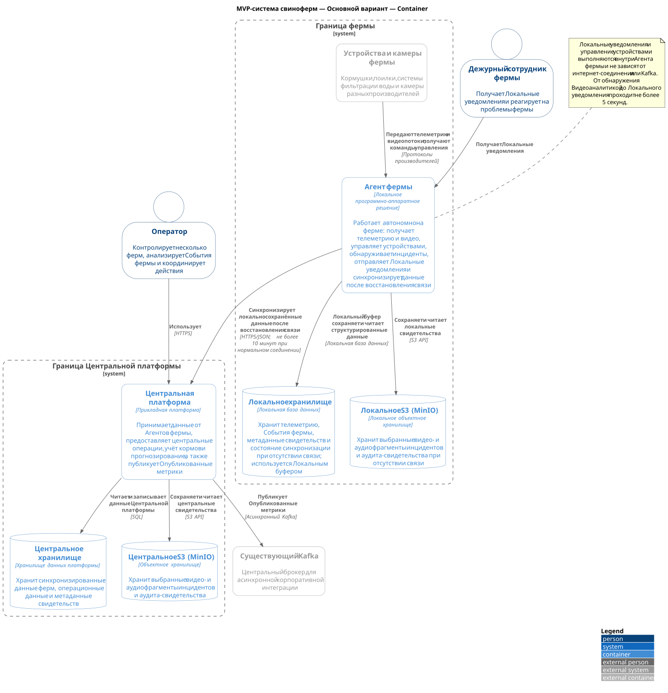

# ADR-002: Высокоуровневое видение контейнерных решений MVP

**Статус:** ⚠️ На рассмотрении  
**Участники:** Владелец продукта; архитектор решения  
**Дата:** 2026-09-01

**Универсальный язык:** [ubiquitous-language.ru.md](../ubiquitous-language.ru.md)

---

## 1. Контекст

MVP-система свиноферм должна работать с несколькими фермами. Оператор должен контролировать фермы и анализировать События фермы. Агент фермы должен продолжать локальную работу при отсутствии интернет-соединения, сохранять данные и синхронизировать их после восстановления связи.

Task 2 требует сравнить два варианта контейнерной архитектуры: выделенную Центральную платформу и расширение Существующего IoT-шлюза и TimescaleDB.

Архитектура использует две границы развёртывания. Граница фермы содержит Устройства и камеры фермы, Агент фермы, Локальное хранилище и Локальное S3 (MinIO). Граница Центральной платформы содержит Центральную платформу и Центральное S3 (MinIO). В альтернативном варианте Существующий IoT-шлюз и TimescaleDB остаются внешними системами.

---

## 2. Требования

### Функциональные

| Категория        | Требование                                                                                                                  |
| ---------------- | --------------------------------------------------------------------------------------------------------------------------- |
| Мониторинг       | Оператор контролирует несколько ферм и анализирует События фермы.                                                           |
| Локальная работа | Агент фермы получает телеметрию и видео, управляет устройствами, обнаруживает инциденты и отправляет Локальные уведомления. |
| Синхронизация    | Агент фермы сохраняет данные локально и синхронизирует их после восстановления связи.                                       |
| Интеграция       | Центральная платформа публикует Опубликованные метрики в Существующий Kafka.                                                |

### Нефункциональные

| Категория     | Требование                                                                                              | Критичность |
| ------------- | ------------------------------------------------------------------------------------------------------- | ----------- |
| Автономность  | Локальные уведомления и управление устройствами не зависят от интернет-соединения или Kafka.            | Высокая     |
| Изоляция      | Изменения MVP не должны нарушать работу Существующего IoT-шлюза.                                        | Высокая     |
| Оповещение    | От обнаружения нештатной ситуации Видеоаналитикой до Локального уведомления проходит не более 5 секунд. | Высокая     |
| Синхронизация | Задержка синхронизации не превышает 10 минут при нормальном соединении.                                 | Высокая     |

---

## 3. Решение

### Описание

Основным вариантом принимается выделенная Центральная платформа. Её Центральный сервис синхронизации принимает, обрабатывает и сохраняет данные от Агентов фермы в собственном Центральном хранилище. Центральное S3 (MinIO) хранит выбранные видео- и аудиофрагменты инцидентов и аудита-свидетельства.

Агент фермы работает автономно. Локальный буфер подготавливает данные к синхронизации, Локальное хранилище сохраняет структурированные данные, а Локальное S3 (MinIO) сохраняет бинарные свидетельства. После восстановления связи Локальный сервис синхронизации публикует данные через выбранный надёжный транспорт в Центральный сервис синхронизации.

Существующий Kafka используется как асинхронный корпоративный канал для Опубликованных метрик. Он не используется для Локальных уведомлений, управления устройствами, автономной работы или передачи видео и аудио в реальном времени.

### Контейнерная диаграмма

> [!TIP]
> Установите в Chrome расширение <a href="https://chromewebstore.google.com/detail/svg-navigator/pefngfjmidahdaahgehodmfodhhhofkl" target="_blank">SVG Navigator</a>, чтобы просматривать диаграмму с масштабированием и панорамированием в отдельной вкладке.

Диаграмма: MVP-система свиноферм — Основной вариант — Container

![MVP-система свиноферм — Основной вариант — Container](https://puml.livingmodel.dev/a9f2k7xq/svg/xLtTSjl65Rx7Ks2INhGQonB5NpcEPaXAdAPD6hVoj1Tn9WDBiConHAeaNTjfCcDBjTDMcJXfSz5fPvncEcrlALkqQLccNm5yXJv9ppcBdmLs0In4cK1TWcDQ1FRR_VRiETyUB06mUwFPsZKwnew-QLupRcxtBfktUzNjvbPhnsprz0ruCpkQrdMBtUeOkxzgRlQkwqkBYzp-7UFs1sQtQsoPwyrFJJrNNEHHxvjRPckpqMxrwktjTaT_kq6RKA9cRDpOwhHljZPPkLx7Q7MX0D0GoxOxcsP7BCSLx9WRFQErjMrUlBXDc6h7D5PMzDzgEcnNtSOsX4heE3KW7ljSseHTwJhOosptxkoQs5jcYoK_PDFe6LUDRWB4hs-QDnCKX_TUSwEvQy08AeECJgTzoovk3rA9Djh33LrWhvo1sUcsMmaQt-X1rL75yKYtTmViRDmok-qT4okG3_LL75AZSySTQ4cD9Sc1kjGBc9kjKzERHlUwkHaqziODyFgpQ8eWrD3kjj5iiUOZ8W8jC9KDYIXRctEL0csn_V3CBC79p2_6KjeyA4BJ9i6YBcqM5CkH98I6NfCvF1bCsoPT4noajM5URTzEtKcONl4quhGf9kxZuBPyH8a8fHcxdMRN_6G2ln6jC86UP8QIBIsPuUEeJ6O8sOAZnYSgmix2EBpcPCP2Fld9ZYCvIYHb95CLft9r3OcgHKMOkdUwFNCdCwAK2Jgs86M2YoD6cI1Z2r4ybscAK2OiunEWR3YE8pu2cyJ2awW65T7P01IS_vcTpEXELXZPqfCLEexwP8MFBK1ATAQfGLcnZq-6CkD4ZXB922KMewILd7gJjiu28cJXpMvuiL9OAjU2tiZj5MniBnOBDbuivsibjlyNh7W7Egul5MdNQjFOQhUCRNllOeYqfK9Peccfyt34B7KYjegfyE1gbU-To22yXALk5PzsfSGcDExDsy00OkqJ5MAb2hw4hnMylSh4AbLyJIW0wNANhVHaXf2xr9CPHivQJn92PoSICXFv5dmoOoV_Ya_AjBJerPLeFhbSgL9R3VBXzYhpoTVBZVhYX6gH2kNGrPSKUVXNNb8aubjrcPOIo0mYhhgaQ1N9YilKsSId2oh4bcaB4kFsffGkfC8zAbr8dP2GBgJEA9WkJ5SabDE5rEqaJnTIeXLtnSbaw-kgNwEhACGPVtSplUjKCi55_RkRwLsrClbt4w_ZufLCM2ZXTpZJl9H5wHkOs2jQ4jSI9rIJNv6GcbXDZ_fPNlqoHT7A3A54Lx-a8LwPiTGfheAPfeWfNxyIAsIdgid-LWTWFLF_WNq1zqU5okr2PI5N-XXCivXmEnj0ORbMhrVBIug0qbh3tcfv1K2ktk2sSYmWjzRmRPKuGBqHs4hHW793s79HW9nOlh4S1IX908qeG4q6A4G0rcI0SWH0LZvWsGa1gp90AG9GJTffcLdN8aTwBQuBaxg6PEYASUwz6ZLgqeYhHTKl3T6YsqWrfoW2-NArLbikvLwVpAW3behbIeNJbcAbKYhaGW5bkxUhowL2FbyeE_Qg5QI0WZHwR4XE19GRKTlgKX1GQaHlQpa_8D-8ssf-G2qMu7Y9fjW0T8C7B2i06aiSO5K5KE80AkNjMDN2D5ZSgaa1jUm1k3uihga0oXoWf53UTZ_Rbohndf7tktUkK8pSybDKZS-3wTHIV3urotPcsSuisvbbEqhP3cKYmLmac8reGYOYvYA-R4HJo4HysOYcaedmsSZffeDyqYcjfWHWewWfDs1d8vfg9k9a8vfg9k84gwQQYJYnfAdEuewTCWQedhBJoStg3bn8Wb493bnU4R0gE5yCe2YuTpIW9WPG9C2VJvLZ0VuGjKKW0X0K0IOpeG29p7125jm2GiRbKvtsrNOl2wjJCq2gWA9SuzUMvJEWFD5XaBnqobGvK-O12gUCFa0X4b0N0KML4sLrmDfaWDBoSi41r0jBdhcy3m1ONgxOGbgXBAlesQ_4Lrjs_hIJFOsTK3Y0Ady6G5d_4Wye4c2L0zIyCZOw7msWdDVraRmhu-60HhN2pJxkXmX0g5dVB00_S8rAER3LHG3l6WqXzLqMNSFdVELIOAkBpZU5U3XTJ4SlfPGbWAAI1l3ALwY7bUUrCd2sBTrcCz0R0GXcKp6BKy7SB8v0LRvq60geHqMA120xErqh95tZg4O0AacNNLut0Amk1VW6G_DLNmd9soipmAdDcaNNc0P0DeFKfH5NO19Hg0Y8UiKvnWFgtc5Xg_lLG5FxMi3hZ1OYBg5JiwRUWBS2CGFC06SEY5kSoZ30ZRWOG5s8wHX0HL2DQ41TqALos5fJIT2bXEdKxBxusNtni_lY_r_lYv_T63-xCNvsO_pinlYaTxebVSIE-u2VQBQ5V6LrjIXSpkxjdUvjyscnZdfuM8fKX0U7fSWb-D2mhDn2dmNRo1yODdL2yUc58hTQ7bz1RjnUPMxL4hxEAiD8YtvKaf45JaAUaGLImLHZwieXCvGqsyY2jUG9HthCucvQdVZXaQdTipervcVuaD8fth6Q5Jv97bAQnlsgMR5JyeULJlDkLTNdZCRUh7gQYe9Rhza3kX_yyjBy-9ur7DyRxra3wyJgw_3niJMqNbgZyU-imVYkTQB_v-wtklK83i1EE8ZlptNuemz7XrRVUZdUep9rXvUcNMzkcdhNvQIntvBIEysjwptjiulq2r4NtcOBmIjpS-pdgURcBYxGaHNzCoXaBp2jE3-DHFlOqvLMTFRa0RQF9OehkciNjfkTPwxepWpYguSzReKxo5V8PWlk85yp46MzOND2-BGmMy6UhM3FLh3Vt1NioE2VhMBFLh5dgzYpLUomLMmx5tdhtNSXjR9UKQRLXoHiDBvxfNMbPVqLaYp8gs3lo7e12ThTyJwKsTCX-nf09dQCkyTVul-wawUTqp4NWtzGtdh6Oxw7qeVZ0wX-E7xebXyVwDPGfwgWLUk8iZuETGGPuNFA31yZxYsTargZgxVXWu6_GUdhoxS0UZhUX_fUZWyWJGIk8-m6L7g4rLl7NFlKq--eA_lZBu0vjVits76CtO3-OIK37S2FeTuZE702lHiGpuV87kePGD4dVWlrTUiLMUwGIcDFlKQ3_RXcT7PMR_RkhEtiRhVlc2QgklSJfTIfxu7U7z3kQ0lu-oluD8JE_TIuTiEWJlmBIT5mURmXHpua5iVODDhp1PBkOy8D1UxJiPTEEdrCW_2Atj4HXbwcZQKnFNz2Xnx0vo5sGdpe8FJ6lDtizfgjBQ96FveIwCkVYICQy07QII3Ecdm5XWCMOBMHCrGNkyrFpGkvfPMFM7iVNrp0FIj8HNWEcEyd-u0M_YfknzY-j6tqhhKxEpNxe6x7dS1IfDL7smLeMVqhhOK5ZvZr7PsH76CfSZSvo66-iC0Sa43ecoUE2nwHYPZpeV_grjVWOqG9Ju4uRph7N8sSa_oZ3-C6uqprW8b5jy0QtO2dmJode_kFly5sZcsIs0f69_FZ9pGk5DDq2aO3Q0qmudLgyzXwYXM_WXWufFW_TgBX4R_J1Tj4Jh2CRJFoANwHJHmstHuiz-TuGyPgX35xtt4qqYy8dy1O_JDud3Fx-Bx41GF3vkBHqFwG6WPCPVUM7rLEDFsZCPANnx4WQv5dSVMmq-KZEZJ0_ZEL23VcEcYccSIIwtdzXnyqM-zz-AE01H-1llmH8CVGO9ZH8um6KdP02iNrqkwBDPgd7lT9jeUu5a3bdg0DYE81awK7TdadC3WGcce-p3nMFy90UPsbrv7AnSyY4qaJwd-i7lq3QPD7EJDYtvuy--GMTtrJZ3E3qwVzyUynkb0e08u3Gv_uPHS67f9vzZnTmE4OMKVkFCqrXPPuvaOA4KEdf_9a-W7DVCz3vmcQzSpVD3VChYxligjulexv7D0tKvC3Edf514_W1RlduSzNyEhRCvljgY2QO9a1KxA0c_uT88Sel8uWWwgIXxsa503UsJJlCBC65vXv-KJ2jOAhSkElT6PLsybHU8cnJxJtnR66AeQa58SqgM2gyPHcQ9jU81HeMa3smRgJvJPIKVEoCoviCMsuXsXo6M3DPYAsNkTLYj48J9v9jHuzehg5Fs4lrIPnh6CLtW-XkVYG_BRla_eeNPSCuRdmVFPSCessZSpcxH4OXbnHPdSt8750XpIs0DgdTqgFMKssST_HCRHjV_pIUiQ638e-51tW19F4VRiBu0AIWTbkRx1P0typNN5iGkSCISYE_fUd4SKX2JKhcslSSvdvUJWOp7ekw7Dprb_44PsRynltnvSlNrhtBAK9PnPKknTdLE-fJt_cvZHUnELr3-pSj0_dB2gAI4goHmpGZJb9fGeeWpoXaSPfYLTFZvOa9tVgnDeE8YSipdp1OU37XYLHrCb_Cn-nXLZ7Q0NUEBSUU0BjKqlLSvvWLzP__huglJpZ1aBbn98p0u1NVi4n3Zb527TuWLHUhrvwB-1rp0V2dVdxg9dbXLyYc4GwlVWc93rEF0D9WsVX9-iV_kmTMkJ0kM94o86UMqHXHyhxI90YdXCahXhwtefEyjoHFQ4EK1JWMHvBE8RX1lF9BLah697FEStsMoTaZE_PAo2WiBGq4drk8aHGudbKtYLbd_HxmAJ-A8qJ_p854wj9pbq5ctqTN6MXSQFcE6vQgzs3EJHPMYQ87XMN9uriTYGPHNEZYB8yu35pPZPtUOiB_U3g74N2CseD9UqXccNaf9nxL1HN1FVcHISdkcWxrktpC6y_8hWlYtMB_icT0znLH5g6EcRgU8GvTp1xU8Bo468f4ldnVKVWXQ0kebCDQB1XDZd_5ix9hPpMokddptiJsNy1)

[Исходный код основной C2-диаграммы](02-01-primary.c4.container.puml)

### Аргументация

| Критерий        | Обоснование                                                                                                                                                                                                             |
| --------------- | ----------------------------------------------------------------------------------------------------------------------------------------------------------------------------------------------------------------------- |
| Изоляция        | Новый домен, API, модель данных, правила хранения и эксплуатация не изменяют Существующий IoT-шлюз.                                                                                                                     |
| Автономность    | Локальные данные и свидетельства сохраняются в Границе фермы; локальные реакции не зависят от сети.                                                                                                                     |
| Развитие в SaaS | Собственная Центральная платформа не связывает будущих клиентов с текущей IoT-платформой компании.                                                                                                                      |
| Интеграция      | Существующий Kafka повторно используется для публикации Опубликованных метрик корпоративным потребителям.                                                                                                               |
| Технологии      | Выбранный надёжный транспорт используется для синхронизации, локальные протоколы производителей — для устройств и камер, Kafka — для асинхронных метрик, SQL — для структурированных данных, S3 API — для свидетельств. |

#### Последствия

**✅ Положительные:**

- команда самостоятельно определяет Центральный сервис синхронизации, его интерфейс и транспорт, а также модель данных;
- изменения MVP изолированы от текущей нагрузки Существующего IoT-шлюза;
- проще контролировать доступ, хранение и развитие в SaaS-платформу;
- отказ интернет-соединения не блокирует Локальные уведомления и управление устройствами.

**⚠️ Негативные:**

- MVP дублирует часть возможностей Существующего IoT-шлюза и TimescaleDB;
- требуется развернуть, эксплуатировать, контролировать и защищать дополнительные контейнеры.

**↗️ Зависимости:**

- Существующий Kafka и контракты Опубликованных метрик;
- локальная инфраструктура, устройства и камеры каждой фермы;
- Локальный буфер, Локальное хранилище и Локальное S3 для автономной работы.

---

### 4. Альтернативы

### Контейнерная диаграмма

> [!TIP]
> Установите в Chrome расширение <a href="https://chromewebstore.google.com/detail/svg-navigator/pefngfjmidahdaahgehodmfodhhhofkl" target="_blank">SVG Navigator</a>, чтобы просматривать диаграмму с масштабированием и панорамированием в отдельной вкладке.

<!-- preferred -->
<!--  -->

Диаграмма: MVP-система свиноферм — Альтернативный вариант — Container

![MVP-система свиноферм — Альтернативный вариант — Container](https://puml.livingmodel.dev/a9f2k7xq/svg/xLtTSjl65Rx7Ks2INhGQonB5NpcEPaXAR3sDfsxbQI-IJ0QMO9bZYLH9khRIP4QoQYUjCdQIvgBJpZZDTDhUKhOOqx94lGBm2dsIdZsx01RO1R0GPG9D2Orb4TYp--tPiz_vTac0tRlDrhRHCRRqTVEsSM-pTzDyqAjkDZTQMsQhfw_1BxEZQLstsFsEiVsRvdhlZhumFy-Ttp8UN3UxNMF3N6r-REgvuZnlzPwvORRM6-rMhzxUR7Vqjnju22LgnjhTZKxxNckTbkjrZ5ON2W0CiMoxisvsn79SmOwvrZDQ6vlcrQkRQ5FjcCRIalvxJOVZbjlOcb09NiS6n6kVIfjWbQw2lynsRsVR9BsblbZmcwmRFUEMqKrWyTjxvhq4nU5thxdMt3PW19MDZ4wdVPyLPuDKmWFFS4CNE2j7O7QwxLQ2njTwK7LKSNAbszi1FnltpMvxooGLo8Vw5XbIexFZ3hIanfBaGbqQ1JJCLh7fTQDxnrmFEdljBaJzHJI59jZGzgRHRD7c8sO4yS143W94sTjSg1JmYEs7vsQ9dSpzubnA6mVEqBH1q5cNDWgSov4WX8RUa3iy6apR9rqJ0gIrPjvgFqWzI2XVyJ3Yk2bctiUPC_g88X6K6TkTPjVyQ8ou4Rqm1fza1XAZbipWSLWcCu0OuQZXYPfX5-4SddCouo4V_MGda1mcaYAIiOfJkJg7HDMYGapTdMxFtCeCAMK23YEaJ61no2WJO1WHnMEP90bbmZC-0if6u3Za8w19J3o9Qb0XdJMmWlMVsSaCxsG54QEUhC1ns2ShU1W1AS6P90TbnJy-6ifC43bC90EKc8oILdBkGzewdH0X6s-iuVbAOQ5S2qOZTrRmCTii5dmyNyxNIlJyhsZn3dHSNoZYgUMciT5k6Plix7m8jQK2MS9fgUDmo2nr88p5L71mjShFZkKGdi9IzugFkr924phlpGU00ERQHoh0IXNo8xoju9rL1bQfafyn2I1TxBATdim0ShTwCeF8sUj90kZYI4Bc8j-6JsRyvD_nIHcM5hsx4eqdbojLQij1FDnPPJpvUhbHdn-JBLA17BhxaY8E_yvBYa1ykowJOWAPGyHTbnIz8jbncJYQUBcW0cmHZo0mxcnASY4Lx55o8NL0Wbn87L5GBaoM99JbGkf-aik5b635VU9alFrrrRVHLHZYWj-xcTpdL3A1HVszcybzQcNyzoRUn8TNCk6XXE_XJFAZB4hlmCH-eYLnBN54DVud4b8Zgyb1lyXFlqoGj383AD6dNz8WhynuwXoVWfaaYIb_VYMMoCvL4tjN1ynwfluZzW7kzmkL1uNANAxq8RXcFk5nCGQ5nLgzNYqlA1gKLXhigEKL37Br1dUKOmroAmtVKOapg3S2HodQeDmGZboKGKuitrYCCYX931fH1ZMPGI72O4LcK8uma9KFU7PCWsMPGId2e9gqqpAthaIEz4fS5yOD3SdG5UF2UpbgrAGphXPLltIA5jr6gZb54iYNgxNQOYdtvcX6tM2XMAvKE6ufLYgbGYxKeCnwkxnOAkJpXRBZhrf1Qb2GpXvcaXCDoeseOtaXQ51gH1yhERz1lX5trFm6jLW39qeqnGQW6xp1ee91Ou4pM5OnA746AkNPNDN2E5WygaaDQjapuFemlw9YKEOCIWhbMVYnMAh4HqRU7zwvGZ7oo4-GDJuDogc5U3qrLJjJjJDLErErewHsK8a4jKXGZMY24X6rY4-DQ0fAnAT6D1KbmgkHywM3VDAKLbCoeAEeAJV0r8YcgaGSDQAfAX5dicggIiIPIvfg5dVyb363wZaxdTojxi2528nASE3oYWRBGl3561I5y8usg8aJADB0hwVAiGR-ASf88C8WI0AKPa8D93J34Ldm210PfwSwxLljNXPsfwO6gHeKvHo_iYZFW7AXGqtoqfIfibBc3HIMZ3w3GgH1NJGegYoKrGrMnZCeBIuM78DwOS5pb_S231ONAun8AwYoYfx_IdorPUTF9lOqkg1m3Ahy2W1L_m9lK4I3PSwWvfLXrlbe0zIyRepaNHeFDsXKArpsSLz468IwzOTbm0zSer8E77NHW0-DXY1z5yNGy0LVkHGuwcBmJM0-d6zEHs-bb2K6HIKEu9clK0yhptDbOBKjFQOPw0TX45HJCPjJGMqM1w0gtpeCDQX7pHI9WMnrkb98kiTHZJ2e9DrsUTC6u7MfWMymD5_rbH3TNfaQdDkjMGoDIHZ8CaXTEkCAb28A5S6YNd6kyGPrxx9mrFrieAczBU1rHWiXbz3KhAatuEr0J0sc1XTk4BSvbM43TyR56DI5EHrZK15O8zgWBl1IEMolgIJmKa8vDRqlVdfV_FI--F_N--AdDyPFRuoVtXW_lJ4-wPrkIH-nupxW9nfj8LzPNYuA7sVtpaxsjlcqK4SzF2n5ACA3mrB44dneM5PkeS-2R-GF39iue7XveOYjbYS_GMpSMMLirHBvkIY5aHRyA96H1Ko2piW2gA3Kc3Xpo1mbLHjPy9PSSAI7BEwcrR4V7fdQFQiJGtw13ocTu1shMS6Jv26bQTolcXK_9NzOwIJlLbLzpcZipQhdgIXuz9ezW7lzrpTcxJrhQE_P3ws1TMBrTNZvt1fQfzR8_eCri7Uj4_q_kz_erfVMQ_iBKWfEdLfz-6i81K_j0-kL3d_quVJGwiE9XrY-xc3KxZJNJRthmjFerqhfdUR6dPxsoLNyigWhRzCzuQMP6VfDLJCpL-VmofB-2HHYUqrBphSauJdweAKbdJw4W9wZcd59Trr4JzCbvvBk91DVFVJ9Azn5laAQEBYBVCq0bFQ6feVm337Tp9vkPaytit-uczcHat-weJtTq9vkQ4ytjCCsj9aMUUlTTtNhcNM62elegv6z-q7hWvRrLsj4P1MS7LclGQljsljGvg4ECcm0QksOdBQ_8F_hZcIxf1Cf1l-WlFMIj_aEIX_Q1qI-sK_TylQ1RWrrh0fQjOvG079MHo0ENw58V4xitj8vgZMwUXjU6EJhA7rz-GQClhVtYLv4bGXOHwGRKEaHgTuwvjh7ddwBNTctFmFasExVuCGnwGRqZrGoqC7uETHx11TEe7S3nFcKe8Tw1b3qXTz3VTqwGyyTOcdIKw_HO3zk6vsjvNkzdPMjxStsZcaILlU-hHGxzHt0-oFnE_45_Fq4NWsXSpytRjyri1F_8g1mk3pS894F4SKnQPhuypK1tIVQ6meymckdH7IJeiSu26VusnNQz18fJPJw2xpq65uFIIV4vmz2Rym7pMwlsTf0Q0cwSgrzSzR-710-iLvYZxx6IFiSnmo6yR6qWux59HsXxS7h8Gx9gUC1cMDEI5IGqI1njKS6LG_uXCIlQa-ljNi_DNhcVMD7xExDvfRPNJCspUMQlrFsKp8KXm3g9OcM8vmvWCr-9EiAl7xA5O8W76BmxTcFS04ree7Ebb3m_yWwWdYc4tLeFtAZBxGpFHVeBVpIcy2e_HdzHwB-CO4hE9N6oHb4EuGED3PovjVLRlDZyqfkOUbzsjg7L-V8cIK2H7YEc-yh5m4K-LRZZh5vOzFetMvtjchieix8Ka0fmaA_1M1P_GzQStCUCEjRN4KUarB84N8Z1_dS76KD71jW18paFlWS9XVEVsce3dHmaSEo65Smpi0vzbU4COvP8p1qI8cKF5wWNv58SL1n0Am1eLaTsposlYSLdm7n72Bf7ZiKz8m_wHep82Ua3EipXZU_oIcwNMVEThyEESJN8wXxDQ__-7gpTUqNFmdu-1bGqP_0v1Y0qw8ursYNI7u1JWXu-9zkp467dWFqGtQ2TOD4EqaHerdqMHyPVaXs4B3S2z9FX7X06UmnAq-up74qCoBUd6KJw8Xu1ugHZGUQU_hXFeB-KYKUEL_uX3FMX22f8dOM_8F0nf1nacUVvTa-3lskBnivoHvVxGFf79FG97a01mPVyPirr7X8zsMyQDOPwHo8JUqYoI6tEP5Dw1NBe-i7c2HVXN8J9aZpTyqriwlBk_mbZ3OEhAzZlW3q9NKCG6UM8S0J-87Ji_3d6VpqMH9aeRgBf3sWyoyGfdy7aqEYCHpv05o04NQAQW5-KqNW8BC6LwXxUStXUi6Tc_OJdNgL1JcX2qJievfzSQn9ShYae_OWL4PKoVUOp1cym5Im3qXXC0tMdKm6YUdJ9-IuQKiKnXwnnf01r9G_QTxoAYMp4P2yb38KYOZg1ldYUoatYMCjaaraUFJ3adC4HSc6y5AuzBt4U1XpZkUUC19YJgRPPWIEmL2Ca2qql8Sujc2qZxzHITEQc7FVqL42dJ4v_v8E6HHzAWR02T6J-wmB8oec0WEpsGODiGgYd7pJkkBOXEOCoPGT_I-d4SKX2NKhpJNkicTs5Yu6S_KLVMR6-eiueZCpVkV-xERD6wkUfpHX4OArU_CCwpttIcbcHkD9N5xtW2cgFgm9L1WHcUGX8Y1Xp54gLe2wvmH7cgGbdZqzM18bwDH9QZk8J5W1zz7EODyaImFiPD1VhtmBaUZPpFa7DUDh_-oWxC0cW_sL5z_ZaQ_Wegy3C-WLPZTmyLUGPbYV7Z8KUtGvQJzy1xSDk7d9LKcI9pOzq7FpX1I92_P93zbiENKKk4i49_AQS2atOFi8D5aFkJ6I30eE5h_qmL7wZdCaoxFIz1RKrJuUPqGVzD_gBz_Z80LdRsJm16VVnO4YorAa8sUvILRSrHlNuf0AdlitvK19rgTx3xAb4L65_gNHgxWra3Xp5TpgAVQGGIOa_1dNWP1rN3Y_2w3o0IS6MCANB4FumSku_WaU0dcFRNL1ViGziEY04E8WiGgITqdPnNuI6zUzaRE9xaVHYJJEUbdmsPV1xJGSDsoEmwQrsZrGGCb4jP2oiBXSybDjWqaGTvUUE2hkkJktXzn2oRSgrIdDGbTVOcjaiVUKk6NaB1YST-314RCYpI9SuZlQxSkWkfwXkMyDuXRzsitWxdOnxZSUqrsa8x9Y2cg_5oJ3XNWAcS9-vAHdrXKlhHGno-9WWnQu_1PHLAsSrihfbozxCkI_)

[Исходный код альтернативной C2-диаграммы](02-02-alternative.c4.container.puml)

| Вариант                                          | Плюсы                                                                                                       | Минусы                                                                                                                | Почему отклонен                                                                                                                                          |
| ------------------------------------------------ | ----------------------------------------------------------------------------------------------------------- | --------------------------------------------------------------------------------------------------------------------- | -------------------------------------------------------------------------------------------------------------------------------------------------------- |
| Выделенная Центральная платформа                 | Изолирует новый домен, API и данные от текущей IoT-платформы; поддерживает развитие в SaaS.                 | Дублирует часть возможностей Существующего IoT-шлюза и TimescaleDB; требует новых операционных затрат.                | Не отклонён; выбран как основной вариант.                                                                                                                |
| Расширение Существующего IoT-шлюза и TimescaleDB | Повторно использует существующие центральные возможности и может сократить объём первоначальной разработки. | Требует проверки пригодности, изоляции данных, правил доступа, хранения и влияния изменений на текущих пользователей. | Данные не подтверждают, что системы поддерживают Центральный сервис синхронизации, нужную изоляцию и правила доступа без риска для текущей эксплуатации. |

Повторное использование офисного Существующего S3-озера данных отклонено отдельно. Оно недоступно Агенту фермы при отсутствии интернет-соединения, не обеспечивает ферма-локальное хранение свидетельств, а его пригодность для изоляции клиентов, разграничения доступа, хранения и будущей SaaS-модели не подтверждена. Такое повторное использование связало бы MVP с владением и эксплуатационными ограничениями существующей платформы. Поэтому оба варианта используют новое Локальное S3 (MinIO), а Центральное S3 (MinIO) сохраняется и в альтернативном варианте.

---

### 5. Риски

1. **Существующий IoT-шлюз или TimescaleDB несовместимы с альтернативой.**  
   _Меры:_ проверить Центральный сервис синхронизации, его интерфейс и транспорт, схему данных, изоляцию, правила доступа, хранение и влияние изменений на текущих пользователей.

2. **Потеря интернет-соединения приводит к потере данных или задержке синхронизации.**  
   _Меры:_ использовать Локальный буфер, Локальное хранилище и Локальное S3; синхронизировать данные после восстановления связи.

3. **Корпоративная интеграция нарушает локальные реакции.**  
   _Меры:_ не использовать Kafka или Интернет для Локальных уведомлений, управления устройствами и автономной работы.

4. **Недостаточная изоляция данных в повторно используемых системах.**  
   _Меры:_ до выбора альтернативы подтвердить разделение данных ферм, доступ по ролям и правила хранения; при отсутствии подтверждения использовать основной вариант.
