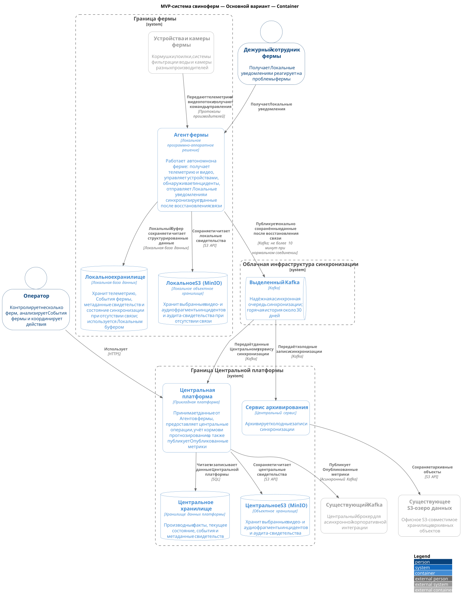
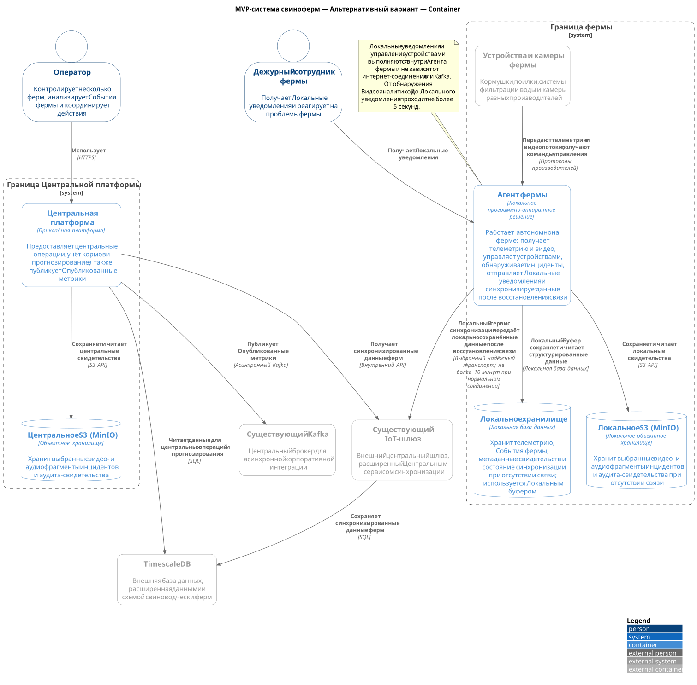

# ADR-002: Высокоуровневое видение контейнерных решений MVP

**Статус:** ⚠️ На рассмотрении  
**Участники:** Владелец продукта; архитектор решения  
**Дата:** 2026-09-01

**Универсальный язык:** [ubiquitous-language.ru.md](../ubiquitous-language.ru.md)

---

## 1. Контекст

MVP-система свиноферм должна работать с несколькими фермами. Оператор должен контролировать фермы и анализировать События фермы. Агент фермы должен продолжать локальную работу при отсутствии интернет-соединения, сохранять данные и синхронизировать их после восстановления связи.

Task 2 требует сравнить два варианта контейнерной архитектуры: выделенную Центральную платформу и расширение Существующего IoT-шлюза и TimescaleDB.

Архитектура использует две границы развёртывания. Граница фермы содержит Устройства и камеры фермы, Агент фермы, Локальное хранилище и Локальное S3 (MinIO). Граница Центральной платформы содержит Центральную платформу и Центральное S3 (MinIO). В альтернативном варианте Существующий IoT-шлюз и TimescaleDB остаются внешними системами.

---

## 2. Требования

### Функциональные

| Категория        | Требование                                                                                                                  |
| ---------------- | --------------------------------------------------------------------------------------------------------------------------- |
| Мониторинг       | Оператор контролирует несколько ферм и анализирует События фермы.                                                           |
| Локальная работа | Агент фермы получает телеметрию и видео, управляет устройствами, обнаруживает инциденты и отправляет Локальные уведомления. |
| Синхронизация    | Агент фермы сохраняет данные локально и синхронизирует их после восстановления связи.                                       |
| Интеграция       | Центральная платформа публикует Опубликованные метрики в Существующий Kafka.                                                |

### Нефункциональные

| Категория     | Требование                                                                                              | Критичность |
| ------------- | ------------------------------------------------------------------------------------------------------- | ----------- |
| Автономность  | Локальные уведомления и управление устройствами не зависят от интернет-соединения или Kafka.            | Высокая     |
| Изоляция      | Изменения MVP не должны нарушать работу Существующего IoT-шлюза.                                        | Высокая     |
| Оповещение    | От обнаружения нештатной ситуации Видеоаналитикой до Локального уведомления проходит не более 5 секунд. | Высокая     |
| Синхронизация | Задержка синхронизации не превышает 10 минут при нормальном соединении.                                 | Высокая     |

---

## 3. Решение

### Описание

Основным вариантом принимается выделенная Центральная платформа. Её Центральный сервис синхронизации принимает, обрабатывает и сохраняет данные от Агентов фермы в собственном Центральном хранилище. Центральное S3 (MinIO) хранит выбранные видео- и аудиофрагменты инцидентов и аудита-свидетельства.

Агент фермы работает автономно. Локальный буфер подготавливает данные к синхронизации, Локальное хранилище сохраняет структурированные данные, а Локальное S3 (MinIO) сохраняет бинарные свидетельства. После восстановления связи Локальный сервис синхронизации публикует данные через выбранный надёжный транспорт в Центральный сервис синхронизации.

Существующий Kafka используется как асинхронный корпоративный канал для Опубликованных метрик. Он не используется для Локальных уведомлений, управления устройствами, автономной работы или передачи видео и аудио в реальном времени.

### Контейнерная диаграмма

> [!TIP]
> Установите в Chrome расширение <a href="https://chromewebstore.google.com/detail/svg-navigator/pefngfjmidahdaahgehodmfodhhhofkl" target="_blank">SVG Navigator</a>. Когда диаграмма откроется на странице GitHub, переключите страницу в формат `Raw` чтобы просматривать диаграмму с масштабированием и панорамированием в отдельной вкладке.

Диаграмма: MVP-система свиноферм — Основной вариант — Container

[Исходный код основной C2-диаграммы](02-01-primary.c4.container.puml)

### Аргументация

| Критерий        | Обоснование                                                                                                                                                                                                             |
| --------------- | ----------------------------------------------------------------------------------------------------------------------------------------------------------------------------------------------------------------------- |
| Изоляция        | Новый домен, API, модель данных, правила хранения и эксплуатация не изменяют Существующий IoT-шлюз.                                                                                                                     |
| Автономность    | Локальные данные и свидетельства сохраняются в Границе фермы; локальные реакции не зависят от сети.                                                                                                                     |
| Развитие в SaaS | Собственная Центральная платформа не связывает будущих клиентов с текущей IoT-платформой компании.                                                                                                                      |
| Интеграция      | Существующий Kafka повторно используется для публикации Опубликованных метрик корпоративным потребителям.                                                                                                               |
| Технологии      | Выбранный надёжный транспорт используется для синхронизации, локальные протоколы производителей — для устройств и камер, Kafka — для асинхронных метрик, SQL — для структурированных данных, S3 API — для свидетельств. |

#### Последствия

**✅ Положительные:**

- команда самостоятельно определяет Центральный сервис синхронизации, его интерфейс и транспорт, а также модель данных;
- изменения MVP изолированы от текущей нагрузки Существующего IoT-шлюза;
- проще контролировать доступ, хранение и развитие в SaaS-платформу;
- отказ интернет-соединения не блокирует Локальные уведомления и управление устройствами.

**⚠️ Негативные:**

- MVP дублирует часть возможностей Существующего IoT-шлюза и TimescaleDB;
- требуется развернуть, эксплуатировать, контролировать и защищать дополнительные контейнеры.

**↗️ Зависимости:**

- Существующий Kafka и контракты Опубликованных метрик;
- локальная инфраструктура, устройства и камеры каждой фермы;
- Локальный буфер, Локальное хранилище и Локальное S3 для автономной работы.

---

### 4. Альтернативы

### Контейнерная диаграмма

> [!TIP]
> Установите в Chrome расширение <a href="https://chromewebstore.google.com/detail/svg-navigator/pefngfjmidahdaahgehodmfodhhhofkl" target="_blank">SVG Navigator</a>. Когда диаграмма откроется на странице GitHub, переключите страницу в формат `Raw` чтобы просматривать диаграмму с масштабированием и панорамированием в отдельной вкладке.

Диаграмма: MVP-система свиноферм — Альтернативный вариант — Container

[Исходный код альтернативной C2-диаграммы](02-02-alternative.c4.container.puml)

| Вариант                                          | Плюсы                                                                                                       | Минусы                                                                                                                | Почему отклонен                                                                                                                                          |
| ------------------------------------------------ | ----------------------------------------------------------------------------------------------------------- | --------------------------------------------------------------------------------------------------------------------- | -------------------------------------------------------------------------------------------------------------------------------------------------------- |
| Выделенная Центральная платформа                 | Изолирует новый домен, API и данные от текущей IoT-платформы; поддерживает развитие в SaaS.                 | Дублирует часть возможностей Существующего IoT-шлюза и TimescaleDB; требует новых операционных затрат.                | Не отклонён; выбран как основной вариант.                                                                                                                |
| Расширение Существующего IoT-шлюза и TimescaleDB | Повторно использует существующие центральные возможности и может сократить объём первоначальной разработки. | Требует проверки пригодности, изоляции данных, правил доступа, хранения и влияния изменений на текущих пользователей. | Данные не подтверждают, что системы поддерживают Центральный сервис синхронизации, нужную изоляцию и правила доступа без риска для текущей эксплуатации. |

Повторное использование офисного Существующего S3-озера данных отклонено отдельно. Оно недоступно Агенту фермы при отсутствии интернет-соединения, не обеспечивает ферма-локальное хранение свидетельств, а его пригодность для изоляции клиентов, разграничения доступа, хранения и будущей SaaS-модели не подтверждена. Такое повторное использование связало бы MVP с владением и эксплуатационными ограничениями существующей платформы. Поэтому оба варианта используют новое Локальное S3 (MinIO), а Центральное S3 (MinIO) сохраняется и в альтернативном варианте.

---

### 5. Риски

1. **Существующий IoT-шлюз или TimescaleDB несовместимы с альтернативой.**  
   _Меры:_ проверить Центральный сервис синхронизации, его интерфейс и транспорт, схему данных, изоляцию, правила доступа, хранение и влияние изменений на текущих пользователей.

2. **Потеря интернет-соединения приводит к потере данных или задержке синхронизации.**  
   _Меры:_ использовать Локальный буфер, Локальное хранилище и Локальное S3; синхронизировать данные после восстановления связи.

3. **Корпоративная интеграция нарушает локальные реакции.**  
   _Меры:_ не использовать Kafka или Интернет для Локальных уведомлений, управления устройствами и автономной работы.

4. **Недостаточная изоляция данных в повторно используемых системах.**  
   _Меры:_ до выбора альтернативы подтвердить разделение данных ферм, доступ по ролям и правила хранения; при отсутствии подтверждения использовать основной вариант.
