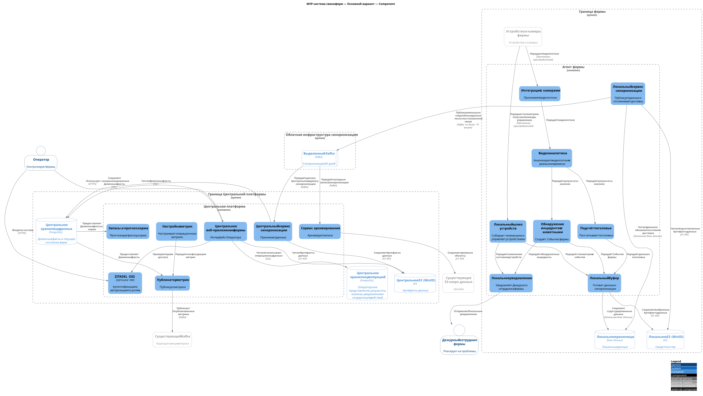
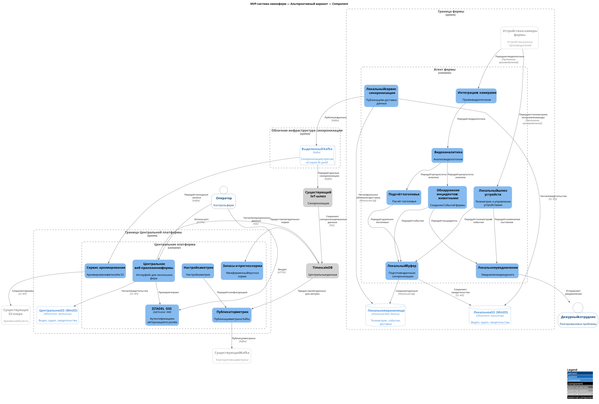
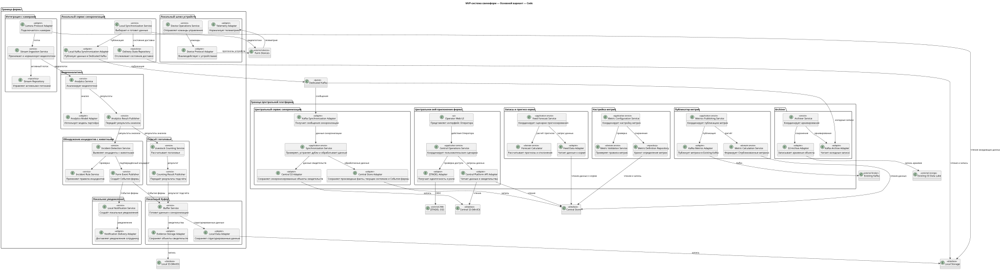

# Диаграммы Task 3

MVP-система свиноферм — Основной вариант — Component

Основной вариант использует выделенную облачную очередь Kafka для синхронизации ферм. Центральная платформа содержит Сервис архивирования.

[Исходный код диаграммы основного варианта](03-01-primary.c4.component.puml)

MVP-система свиноферм — Альтернативный вариант — Component

Альтернативный вариант использует Существующий IoT-шлюз и TimescaleDB для центральной синхронизации и хранения данных. Выделенный Kafka и Сервис архивирования остаются общей инфраструктурой синхронизации.

[Исходный код диаграммы альтернативного варианта](03-02-alternative.c4.component.puml)

MVP-система свиноферм — Основной вариант — Code

Диаграмма показывает внутреннюю структуру Центрального сервиса синхронизации и его зависимости от Выделенного Kafka, Центрального хранилища и Центрального S3.

Диаграмма также показывает основные логические модули Центральной платформы и Агента фермы, их хранилища и внешние интеграции.

[Исходный код диаграммы кода основного варианта](03-01-primary.c4.code.puml)
