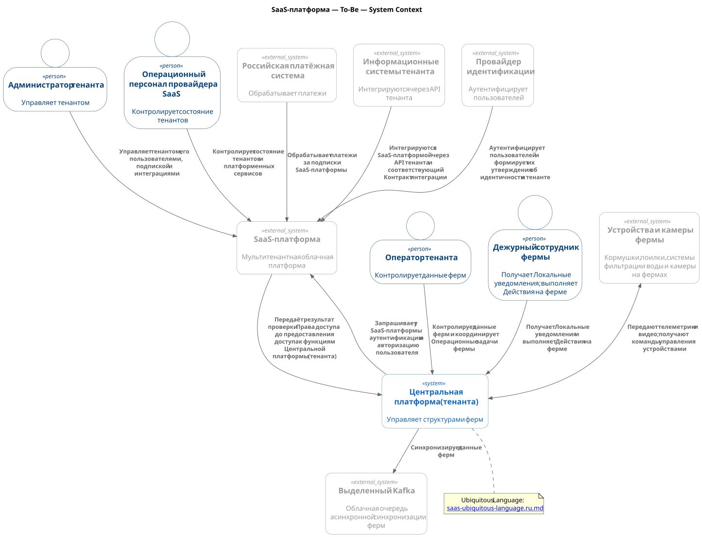
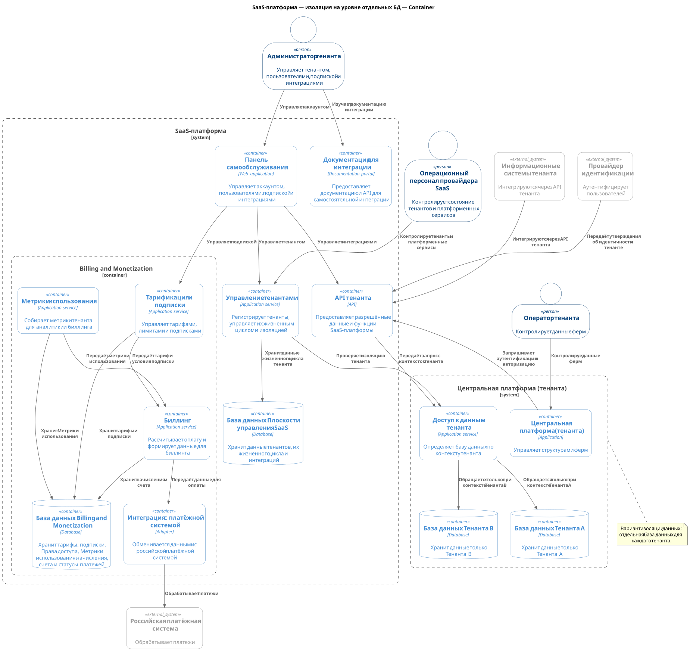
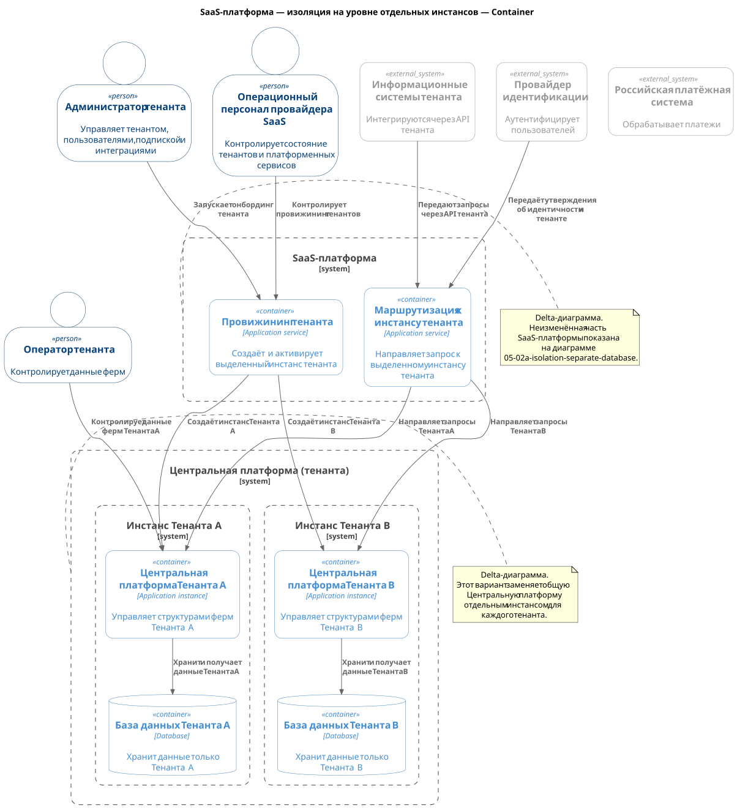
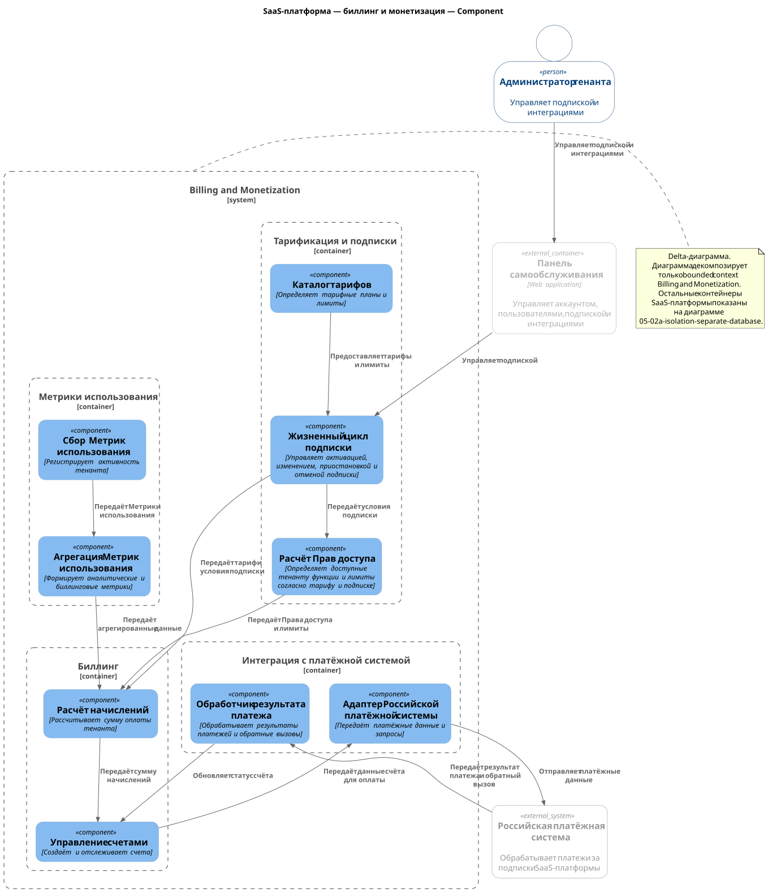

# ADR-005: Варианты изоляции данных мультитенантной SaaS-платформы

**Содержание**

- [1. Контекст](#1-контекст)
- [2. Критерии сравнения решений](#2-критерии-сравнения-решений)
- [3. Сравнение решений](#3-сравнение-решений)
- [4. Биллинг и монетизация](#4-биллинг-и-монетизация)
- [5. Рекомендованное решение](#5-рекомендованное-решение)
- [6. Интеграция MVP-платформы как первого клиента SaaS с SaaS-платформой](#6-интеграция-mvp-платформы-как-первого-клиента-saas-с-saas-платформой)

---

**Статус:** ⚠️ На рассмотрении  
**Участники:** Владелец продукта; архитектор решения  
**Дата:** 2026-09-03

---

## 1. Контекст

После внедрения MVP компания планирует вывести решение как коммерческую мультитенантную SaaS-платформу для нескольких клиентов. Платформа должна обеспечивать полную изоляцию данных между клиентами и масштабироваться по мере роста числа клиентов.

Основной вариант реализации Центральной платформы MVP выбран в [ADR-005: Критерии выбора основы Центральной платформы MVP](../../../../realization/Task4/ADR-005-solution-selection.md).

SaaS-платформа — To-Be — System Context

[Исходный код C1-диаграммы SaaS-платформы](05-01-saas-to-be.c4.context.puml)

Для Task 5 рассматриваются два варианта изоляции данных:

1. Изоляция на уровне отдельных баз данных.
2. Изоляция на уровне отдельных инстансов.

Критерии сравнения должны помочь выбрать вариант, который обеспечит желаемую изоляцию данных тенантов и будет приемлемым по стоимости, масштабируемости и сложности эксплуатации.

## 2. Критерии сравнения решений

Для двух выбранных вариантов используются следующие критерии сравнения:

| Критерий                                                  | Что сравнивается                                                                                                   |
| --------------------------------------------------------- | ------------------------------------------------------------------------------------------------------------------ |
| Изоляция данных тенанта                                   | Насколько вариант предотвращает доступ одного тенанта к данным другого тенанта.                                    |
| Риск доступа между тенантами                              | Насколько вариант снижает риск ошибочного или несанкционированного доступа к данным другого тенанта.               |
| Безопасность и соответствие требованиям                   | Насколько вариант поддерживает требования безопасности и соответствия требованиям к изоляции данных.               |
| Совместное использование ресурсов и риск «шумного соседа» | Насколько вариант ограничивает влияние нагрузки одного тенанта на ресурсы и производительность другого тенанта.    |
| Время провижининга                                        | Сколько времени требуется для создания и подготовки ресурсов нового тенанта.                                       |
| Стоимость инфраструктуры и эксплуатации                   | Какие затраты требуются для создания, эксплуатации и поддержки варианта.                                           |
| Горизонтальное масштабирование                            | Насколько вариант позволяет масштабировать платформу и ресурсы тенантов по мере роста числа клиентов.              |
| Изоляция отказов                                          | Насколько отказ ресурса одного тенанта может повлиять на других тенантов и общие сервисы.                          |
| Резервное копирование и восстановление                    | Насколько вариант позволяет выполнять резервное копирование и восстановление данных и ресурсов отдельного тенанта. |
| Обновления и миграции                                     | Насколько сложно выполнять обновления и миграции для ресурсов и данных всех тенантов.                              |
| Мониторинг и эксплуатация                                 | Какую сложность мониторинга, контроля и ежедневной эксплуатации создаёт вариант.                                   |
| Специализированная настройка для тенанта                  | Насколько вариант позволяет предоставлять отдельному тенанту специализированные настройки и ресурсы.               |

## 3. Сравнение решений

Для сравнения вариантов используются следующие оценки:

| Критерий                                                  | Отдельные базы данных                                                                                  | Отдельные инстансы                                                        |
| --------------------------------------------------------- | ------------------------------------------------------------------------------------------------------ | ------------------------------------------------------------------------- |
| Изоляция данных тенанта                                   | Граница базы данных                                                                                    | Граница приложения и инфраструктуры                                       |
| Риск доступа между тенантами                              | Зависит от корректной маршрутизации и учётных данных                                                   | Ниже, поскольку ресурсы выполнения также разделены                        |
| Безопасность и соответствие требованиям                   | Высокие                                                                                                | Наивысшие                                                                 |
| Совместное использование ресурсов и риск «шумного соседа» | Ресурсы приложения могут оставаться общими                                                             | Минимальные                                                               |
| Время провижининга                                        | Меньше                                                                                                 | Больше                                                                    |
| Стоимость инфраструктуры и эксплуатации                   | Ниже                                                                                                   | Выше                                                                      |
| Горизонтальное масштабирование                            | Общие сервисы масштабируются совместно                                                                 | Инстанс каждого тенанта масштабируется независимо                         |
| Изоляция отказов                                          | Сбой базы данных может затронуть одного тенанта; общие сервисы остаются потенциальным источником риска | Отказы сильнее изолированы для каждого тенанта                            |
| Резервное копирование и восстановление                    | Операции выполняются отдельно для базы данных каждого тенанта                                          | Операции выполняются отдельно для окружения и базы данных каждого тенанта |
| Обновления и миграции                                     | Централизованы, но должны выполняться для множества баз данных                                         | Сложнее, поскольку необходимо обновлять каждый инстанс                    |
| Мониторинг и эксплуатация                                 | Средняя сложность                                                                                      | Наивысшая сложность                                                       |
| Специализированная настройка для тенанта                  | Ограниченная                                                                                           | Более широкая                                                             |

Эти критерии показывают основной компромисс: **отдельные базы данных обеспечивают сильную изоляцию данных при меньшей стоимости; отдельные инстансы обеспечивают более широкую изоляцию и независимость при большей стоимости и операционной сложности.**

SaaS-платформа — изоляция на уровне отдельных БД — Container

[Исходный код C2-диаграммы варианта с отдельными базами данных](05-02a-isolation-separate-database.c4.container.puml)

> [!INFO]
> Вторая диаграмма является delta-диаграммой. Она показывает только изменения варианта изоляции на уровне отдельных инстансов; неизменная часть показана на первой диаграмме.

SaaS-платформа — изоляция на уровне отдельных инстансов — Container

[Исходный код delta C2-диаграммы варианта с отдельными инстансами](05-02b-isolation-separate-instances.c4.container.puml)

## 4. Биллинг и монетизация

> [!INFO]
> C3-диаграмма является delta-диаграммой. Она декомпозирует bounded context `Billing and Monetization` и `Контекст Опубликованных метрик`; остальные контейнеры SaaS-платформы показаны на первой C2-диаграмме.

SaaS-платформа — биллинг, монетизация и Опубликованные метрики — Component

[Исходный код delta C3-диаграммы Billing and Monetization и Опубликованных метрик](05-03-billing-monetization.c4.component.puml)

## 5. Рекомендованное решение

Я бы выбрал изоляцию на уровне инстансов. В этом варианте отсутствует влияние проблем внутри одного инстанса на другие инстансы, миграцию на новые версии БД и кода можно проводить только на одном инстансе и потом распространять на другие. Более высокие издержки на установку и управление такой изоляцией должны быть приемлемы для компании такого масштаба.

## 6. Интеграция MVP-платформы как первого клиента SaaS с SaaS-платформой

Я изначально проектировал MVP так, чтобы интеграция с SaaS-платформой была просто расширением MVP, а не изменением его функционала (Open/Closed Principle). Обе системы существуют совместно на одном уровне иерархии и каждая занимается только своим контекстом (Separation of Concerns, Single Responsibility Principle).

Предметная область SaaS - это аутентификация, авторизация, выдача ключей и маршрутов до инстансов MVP, биллинг, монетизация и т.п. (см. диаграммы).

Предметная область MVP - управление свинофермами.

Поэтому интеграция выражается в реализации SaaS и коммуникации с MVP через API, который принимает от SaaS только credentials и маршруты тенанта, по которым MVP подключается к инстансам (см. изоляцию данных) тенанта. Всеми центральными вопросами управления фермами Тенанта в целом занимается Оператор тенанта через Web UI Центральной платформы. Всеми локальными вопросами управления конкретной фермы занимается Дежурный сотрудник фермы и Агент фермы (приложение).
